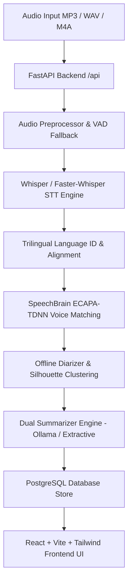
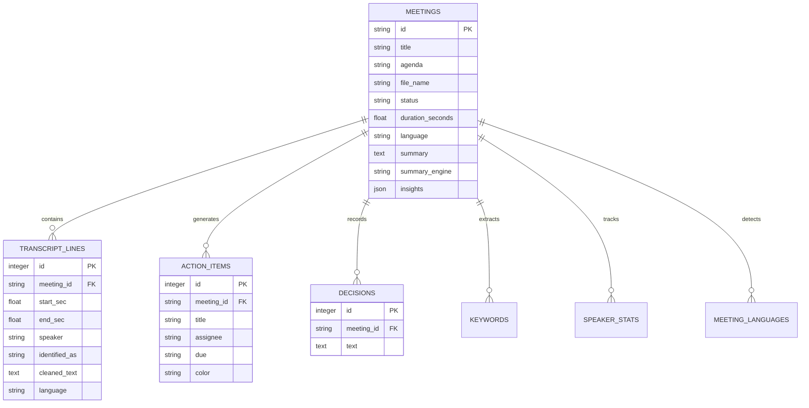

# Nuance — Trilingual AI Meeting Assistant (MVP)

> **Enterprise-Grade Trilingual Meeting Intelligence Platform**  
> Real-time & offline speech-to-text, speaker diarization, voice profile enrollment, verified AI summarization, and NLP post-meeting insights across **English**, **Hindi**, and **Marathi**.

---

## 🛠️ Executive System Overview

Nuance is an advanced AI-powered meeting intelligence system designed for trilingual corporate and educational environments. It processes live and recorded audio conversations, performs code-switched multi-speaker speech recognition, identifies enrolled speakers via voice biometrics, and generates factual, verified summaries, concise action items, and actionable meeting insights.

### Core Value Propositions
1. **Trilingual Code-Switching STT**: Seamlessly transcribes conversations that switch dynamically between **English (EN)**, **Hindi (HI)**, and **Marathi (MR)**.
2. **Speaker Identification & Diarization**: Combines SpeechBrain ECAPA-TDNN voice profile matching with agglomerative cosine clustering and dynamic VAD (Voice Activity Detection) segmentation.
3. **Factual AI Summarization (Zero Hallucination)**: Dual-engine summarizer (Ollama local LLM + Extractive fallback) with strict citation verification—unverifiable claims are automatically discarded.
4. **Intelligent NLP Insights**: Extracts concise action items (max 10 words), key decisions, unassigned tasks, commitments with temporal deadlines, and unresolved topics.
5. **Interactive Audio & Timeline Visualization**: Full-featured waveform audio player with speaker timeline tracking, playback speed controls (0.5x–2.0x), and segment seeking.

---

## 🏛️ System Architecture



---

## 💻 Technology Stack

### Backend Stack
- **Framework**: FastAPI (Python 3.12) with Uvicorn ASGI server.
- **Database**: PostgreSQL with SQLAlchemy ORM and `session_scope` context managers.
- **STT (Speech-to-Text)**: OpenAI Whisper / Faster-Whisper with multilingual code-switching support.
- **Voice Biometrics & Diarization**:
  - `speechbrain/spkrec-ecapa-voxceleb` for 192-dimensional speaker embeddings.
  - `scikit-learn` Agglomerative Clustering with Cosine Affinity & Silhouette Score optimization.
- **NLP & Summarization**: Ollama (`qwen2.5` / `llama3`) local LLM engine + TF-IDF Extractive fallback.

### Frontend Stack
- **Core**: React 18 + Vite.
- **Styling**: TailwindCSS with CSS custom tokens, glassmorphism UI, and dark/light themes.
- **Audio Engine**: Custom HTML5 Audio Player with dynamic SVG/canvas waveform visualization.
- **State & Routing**: React Router v6, Axios REST API integration.

---

## 📁 Repository Structure

```
Nuance-Trilingual-AI-Meeting-Assistant-MVP-/
├── backend/
│   ├── api.py                    # REST API Endpoints (/api/meetings, /speakers, /audio)
│   ├── main.py                   # FastAPI Application Entrypoint & CORS setup
│   ├── config.py                 # Global system configuration & constants
│   ├── db/
│   │   ├── models.py             # SQLAlchemy Database Schema Models
│   │   ├── repository.py         # DB CRUD operations & ORM to JSON mappings
│   │   └── session.py            # DB Engine & session context managers
│   ├── models/
│   │   ├── identifier.py         # Voice profile enrollment & cosine similarity matching
│   │   ├── offline_diarizer.py   # Speaker clustering, zero-vector safety, silhouette picking
│   │   ├── pipeline.py           # Core processing pipeline orchestrator
│   │   ├── speaker_enrollment.py # Voice profile file persistence & loading
│   │   ├── speaker_turns.py      # Speaker segment smoothing & turn aggregation
│   │   ├── summarizer.py         # Ollama/Extractive summarization, action trimming & insights
│   │   └── vad_fallback.py       # Silero VAD / energy-based audio segmentation
│   ├── storage/
│   │   ├── audio/                # Meeting audio files stored on disk
│   │   └── voice_profiles/       # Enrolled speaker voice profiles (.npy embeddings)
│   └── tests/                    # Pytest suite (271+ automated unit tests)
├── frontend/
│   ├── src/
│   │   ├── components/
│   │   │   ├── common/           # AudioPlayer, Cards, Badges, Modals, Pagination
│   │   │   └── layout/           # Sidebar, Header, MainLayout
│   │   ├── pages/
│   │   │   ├── Dashboard/        # Analytics, recent meetings, quick stats
│   │   │   ├── Meetings/         # Meeting list, search, filter, upload modal
│   │   │   ├── MeetingDetails/   # Transcript, Summary, Insights, Audio Player
│   │   │   ├── Members/          # Voice profile enrollment & speaker management
│   │   │   └── Insights/         # Cross-meeting analytical insights
│   │   └── styles/               # CSS tokens & Tailwind customizations
│   └── package.json              # Frontend NPM dependencies
└── startup.sh                    # Full-stack environment bootstrap & supervisor script
```

---

## 📊 Database Schema



---

## ⚡ Key Pipeline Workflows

### 1. Speech Recognition & Trilingual Alignment
- Audio is processed through Whisper/Faster-Whisper STT.
- Per-segment language detection assigns language tags (`en`, `hi`, `mr`) and confidence scores.
- Mixed/code-switched lines are identified and preserved in original scripts (Latin and Devanagari).

### 2. Biometric Speaker Diarization
- `SpeechBrain ECAPA-TDNN` generates 192-d voice embeddings for every audio line.
- Enrolled voice profiles are matched using cosine similarity score against threshold (`0.72`).
- Unknown speaker clusters undergo Agglomerative Cosine Clustering with Silhouette score optimization (`k_max=6`) and zero-vector magnitude masking.

### 3. Action Item Trimming & Insights Extraction
- Action items are trimmed using `_shorten_action_title()` to guarantee **concise titles (max 10 words)**.
- Conversational noise, greetings (*"Good evening sir"*, *"Thank you"*), and small talk are automatically filtered out.
- Unassigned critical tasks, explicit commitments with deadlines, and unresolved pending topics are categorized into structured JSON insights.

---

## 🚀 Quick Start & Operations Guide

### Starting Backend & Frontend
```bash
# Option 1: Full-stack supervisor script
./startup.sh

# Option 2: Manual Terminal Execution
# Backend:
cd backend
./venv/bin/uvicorn main:app --host 0.0.0.0 --port 8000

# Frontend:
cd frontend
npm run dev
```

### Running Automated Test Suite
```bash
cd backend
./venv/bin/pytest
# Result: 271 passed tests
```

---

## 📝 Document Information
- **Project**: Nuance Trilingual AI Meeting Assistant (MVP)
- **Version**: 1.0.0
- **Status**: Verified & Operational


# 🌟 Core Features & Accomplishments

### 1. 🌐 Trilingual Speech-to-Text (STT) & Language Detection
- **Multi-Language Support**: Seamlessly processes **English, Marathi, Hindi**, and **Code-Switched / Mixed speech** (e.g. Hinglish / Marathlish).
- **Dual Processing Engine**:
  - **Local Processing**: Privacy-focused Whisper & Indic Conformer models running locally.
  - **Cloud Processing**: High-accuracy Sarvam AI integration.
- **Language Breakdown**: Calculates and displays exact speaking percentages per language (e.g. *88% Marathi, 10% English, 2% Hindi*).

---

### 2. 👥 Speaker Diarization & Voice Identification
- **Voice Profile Enrollment**: Register known team members by uploading a short voice sample.
- **Automatic Speaker Identification**: Automatically recognizes enrolled team members (e.g., *Yashraj, Siddesh, Mandar, Vaishnavi*) in audio files.
- **Overlapping Speech & Cross-Talk Attribution**: Uses SepFormer source separation to split overlapping voices into clear attributed speech chips.
- **Universal Speaker Renaming**: Renaming a speaker label (e.g. `Speaker_00` ➔ `Siddesh`) instantly cascades across transcript lines, composite overlap headers (`Yashraj + Siddesh`), and speaking time bars.

---

### 3. 🧠 AI Meeting Intelligence (Powered by Qwen2.5:7b)
- **Automated Summary**: Generates concise, structured summaries covering key discussion points.
- **Action Items & Commitments**: Extracts task titles, assignees, due dates, and verbatim transcript quotes.
- **Key Decisions**: Highlights formal agreements made during the meeting.
- **Structured Insights**: Automatically extracts 12 analytical insights:
  - ⏳ **Pending & Unresolved Items** *(clean single-line tracking with owner assignment)*
  - ⚠️ **Attention Needed**
  - 🎯 **Commitments & Deadlines**
  - 🛑 **Risks & Blockers**
  - 🔄 **Follow-ups & Responsibilities**

---

### 4. 📊 Category & Department Analytics (Dashboard)
- **Category Classification**: Distinguishes between **👥 Internal Meetings** and **🤝 Client Meetings**.
- **Department Tagging**: Groups meetings into **🤖 AI Team**, **💻 Software Engineering**, **🧪 QA & Testing**, **🎨 Product & Design**, **📊 Management**, and **🚀 Sales & Marketing**.
- **Project & Client Tracking**: Displays Project Names for internal meetings and Client/Account names for client meetings.
- **Interactive Analytics Charts**:
  - 🍩 **Category Donut Chart** (`CategoryPie`): Interactive ratio of Internal vs Client meetings.
  - 📊 **Department Volume Chart** (`DepartmentChart`): Horizontal progress bar chart tracking meeting distribution.

---

### 5. 🔍 High-Performance Search & Filtering
- **Server-Side Full-Text Search**: Searches across titles, agendas, and transcript lines in all 3 languages.
- **Match Snippets & Highlighting**: Displays exact matching transcript lines with highlighted query terms.
- **Multi-Level Filters**: Filter meetings by **Status** (*Completed, Processing, Failed*), **Category** (*Internal vs Client*), or **Department**.

---

### 6. 🗑️ Meeting Lifecycle & Trash Management
- **Soft Delete to Trash**: Move meetings to Trash with 1-click restore functionality.
- **Permanent Purge & Clear All**: Hard delete unwanted recordings and transcripts permanently.

---

### 💡 Suggested Demo Flow for You:
1. **Dashboard Overview**: Show the 4 Stat Cards, Category Donut Chart, and Department Volume Bar Chart.
2. **All Meetings & Filtering**: Filter by `Client Meetings` or `Software Department` to demonstrate organization.
3. **Upload Meeting**: Upload a new file, select **Client Meeting**, department, and agenda.
4. **Meeting Details**:
   - Point out the **Header Badges** (*Client Meeting*, *Department*, *Project*).
   - Show **Speakers & Talk-Time Bar**.
   - Demo **Overlapping Speech Chips**.
   - Show **AI Summary & Action Items**.
   - Click a speaker label to demonstrate **Instant Renaming**!
